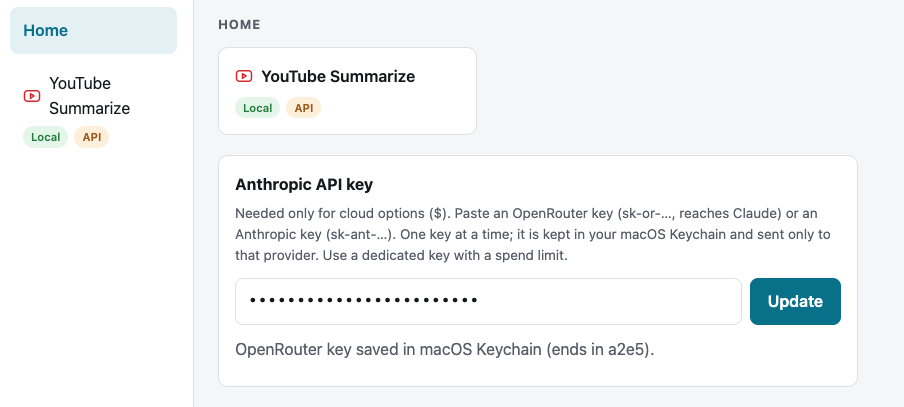

# Learning Panel: YouTube Summarize

A small app that runs on your Mac. Paste a YouTube link and get a structured summary for fast learning: a TL;DR, sections with timestamp links, and key takeaways. Summaries are saved to a history sidebar.

The summary is written by a model that runs **on your Mac for free** (Ollama), or, if you choose, by a **cloud Claude model** through your own API key.

```bash
cd cowork_youtube_summerizer
panel/setup.sh                    # checks everything, installs what is missing, and reports
panel/run.sh [localhost:number]   # starts the panel; the optional value picks the port (default localhost:8000)
```

## Use

Open http://localhost:8000

## Cloud models (optional)

Accepted key: an **OpenRouter** key (`sk-or-…`) or an **Anthropic** key (`sk-ant-…`). Paste it into the key card on the panel's **Home** page and press **Test & save**.



## Limits

- The video must have captions (auto-generated ones count). Videos without captions are reported and not summarized.
- Very long videos (over about 2 hours) are summarized in parts.
- YouTube can block the caption download on some networks (for example VPNs); the panel says so.
- Captions come from an unofficial library, so a change on YouTube's side could break it until the library is updated.

## Troubleshooting

- **"Not a valid YouTube link":** use a normal video URL (`youtube.com/watch?v=…`, `youtu.be/…` or `/shorts/…`).
- **"no retrievable captions":** the video has captions disabled, is private or age-restricted, or is unavailable.
- **"Ollama is not reachable":** start Ollama (`ollama serve`) and try again.
- **A model level is greyed out in the dropdown:** that model is not installed. Run the `ollama pull` command shown in the message (for example `ollama pull qwen3.5:27b`).
- **YouTube blocks the request:** turn off the VPN or try again later.
- **Cloud rows are greyed out:** add an API key on the Home page.
- **"Could not read the Keychain":** unlock your Mac's login keychain; local features keep working meanwhile.
- **The setup reports a problem or "Not ready":** fix the item it names (it says how), then run `panel/run.sh` again. `panel/setup.sh --check` shows the state without changing anything.
- **Claude's preview launcher cannot start the panel** (macOS blocks it from the Documents folder): start it from a terminal with `panel/run.sh`.

## Development

Run the tests (they include the setup script, run against stand-in commands so nothing on your machine is touched):

```bash
.claude/skills/yt-summary/.venv/bin/python -W ignore -m pytest tests -q
```

**Adding a tool later:** add an entry in `panel/tools.py` (including an `icon` name), a view function plus an entry in `VIEWS` in `panel/static/app.js`, and its icon in `panel/static/icons.js`. Icons follow one style (outline, 2px round stroke, `currentColor`), and a test fails if an icon breaks it.

Design specs and plans are in `docs/superpowers/`. Architecture and the full API are in [docs/architecture.md](docs/architecture.md).

## Also included: the `/yt-summary` Claude skill

`.claude/skills/yt-summary/` is a separate way to get a summary: run `/yt-summary <link>` in Claude Code in this folder, and Claude writes the summary and publishes it as a web page. It **uses Claude credit** (the panel above does not, in local mode). The panel shares this skill's virtual environment and two of its files (`fetch_transcript.py` and `build_page.py`), so do not delete that folder.

## Tech stack

| Part | What is used |
|---|---|
| Server | Python 3.9, standard library only |
| Page | HTML, CSS and plain JavaScript (no framework) |
| Captions | `youtube-transcript-api` 1.2.4 (free Python library) |
| Local model | [Ollama](https://ollama.com) with `qwen3.5` 2b / 9b / 27b |
| Cloud models (optional) | Claude Haiku 4.5 / Sonnet 5.5 / Opus 5.5 via OpenRouter or Anthropic |
| Key storage | macOS Keychain |
| History | one JSON file, `panel/data/history.json` |
| Tests | pytest |

Details: [docs/architecture.md](docs/architecture.md).
